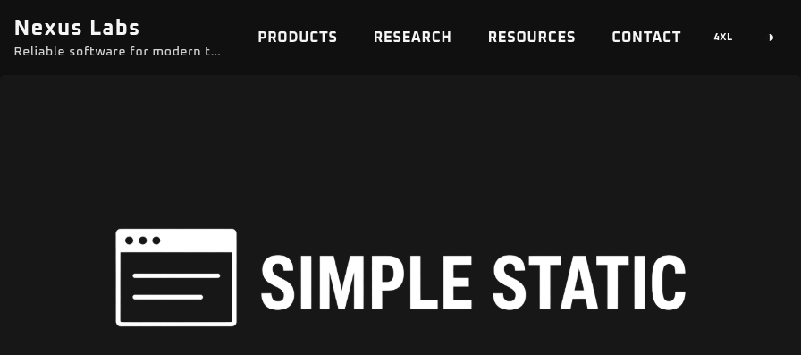

<!-- SPDX-FileCopyrightText: 2026 ALKONTEK <git@alkontek.com> -->
<!-- SPDX-License-Identifier: BSD-2-Clause -->

# Simple Static Website Template

A multi-page static site starter that stays small on purpose.

HTML pages, a short CSS token system, and a few vanilla JS modules. Vite builds it. Tailwind and Sass style it.
Alpine.js and Anime.js are on the shelf if you need them — the sample site does not require either one to run.

The layout is **fully responsive**: fluid grids, adaptive spacing, and a desktop nav that collapses to a mobile menu.

**Example website:** [https://sswt.tekfed.org](https://sswt.tekfed.org)



---

## Why this exists

Most "simple" starters are either too bare (one HTML file, no theme) or too heavy (a framework, a component library, a CMS).  
This template sits in the middle:

- **Simple** — plain HTML pages, no router, no runtime framework required, no build plugins beyond Vite itself.
- **Robust** — multi-page production output, theme tokens that survive light/dark, persisted UI prefs, a shared layout shell, and a small set of components you can copy without learning a new API.
- **Responsive** — works from narrow phones to wide desktops without a separate mobile site or framework.

Five runtime/dev packages. That is the whole toolchain.

| Package                              | Kind             | What it does                                    |
|--------------------------------------|------------------|-------------------------------------------------|
| `vite`                               | dev              | Dev server, bundling, multi-page build          |
| `tailwindcss` + `vite` + `postcss`   | dev              | Utility layout                                  |
| `sass`                               | dev              | Theme tokens and component styles               |
| `alpinejs`                           | optional runtime | Declarative UI when you outgrow a click handler |
| `animejs`                            | optional runtime | Motion, when you want it                        |

**No store, no compiler, no hydration.**

---

## Quick start

```bash
git clone https://github.com/alkontek/simple_static_website_template.git
cd simple_static_website_template
npm install
npm run dev
```

| Script            | Result                                                     |
|-------------------|------------------------------------------------------------|
| `npm run dev`     | Vite dev server. Pages in `pages/` are served from `/`     |
| `npm run build`   | Production build into `dist/` (HTML flattened to the root) |
| `npm run preview` | Serve the production build locally                         |

Drop `dist/` on any static host: GitHub Pages, Netlify, Cloudflare Pages, nginx, S3.

---

## What you get

### Multipage, still static

Pages live in `pages/`. Vite is configured with one input per page. Two tiny plugins keep URLs honest:

- **dev** — `/products.html` is rewritten to `/pages/products.html`
- **build** — HTML is emitted at `dist/products.html`, not `dist/pages/products.html`

Add a page:

1. Create `pages/about.html` (copy an existing page).
2. Register it in `vite.config.js` under `build.rollupOptions.input`.

No file-based router. No magic folders.

### Shared header and footer

Chrome is not copy-pasted. `pages/_header.html` and `pages/_footer.html` are inlined by Vite in both `dev` and `build`:

```html
<body class="flex min-h-dvh flex-col">
  <!-- include:_header.html -->
  <main class="flex min-h-0 flex-1 flex-col">…</main>
  <!-- include:_footer.html -->
</body>
```

Files starting with `_` are partials, not routes — do not add them to `rollupOptions.input`. Edit a partial and the dev server reloads every page.

### A six-color theme, not a design system

Tokens live in `src/theme.scss` as CSS variables. Each color has three stops: `lum` (lighter), base, and `dark`.

| Token           | Role                           |
|-----------------|--------------------------------|
| `paper-white`   | Surfaces and page background   |
| `ink-black`     | Primary text and chrome        |
| `neutral-gray`  | Borders, captions, muted UI    |
| `signal-blue`   | Links and primary actions      |
| `alert-red`     | Errors and destructive actions |
| `confirm-green` | Success and positive state     |

The same names are remapped under `html.inverse`. Change the hex values once; light and dark stay in sync.

### Inverse theme that does not flash

A few lines in `<head>` read `localStorage` before paint and set `html.inverse` / `data-site-width`. The toggle button only flips the class and persists the choice.

```html
<script>
  try {
    if (localStorage.getItem('theme') === 'inverse') {
      document.documentElement.classList.add('inverse');
    }
  } catch (_) {}
</script>
```

Default the homepage to inverse by putting `class="inverse"` on `<html>`. The toggle still overrides it.

> #### Navigation flash
> Moving between pages can still flash the opposite theme for a frame: markup paints first (`class="inverse"` or not), then the head script applies the stored preference. Vite dev is worse because CSS arrives via JS. If you only need one variant, there is nothing to reconcile — leave `html` as light or `class="inverse"`, drop `#theme_toggle`, and skip the theme `localStorage` script. The switch can stay disabled.

### Content width you can feel

`4xl` → `6xl` (default) → `full`. One attribute on `<html>`:

```html
<html data-site-width="6xl">
```

Header, main, and footer all read `--site-max-width`. Preference is stored as `siteWidth`.

### Layout shell

Every sample page uses the same three regions:

```html
<body class="flex min-h-dvh flex-col">
  <!-- include:_header.html -->
  <main class="flex min-h-0 flex-1 flex-col">
    <div class="container main-behavior">…</div>
  </main>
  <!-- include:_footer.html -->
</body>
```

`header-behavior`, `main-behavior`, and `footer-behavior` keep padding and max-width consistent. `padded-content-0` / `-1` / `-2` are the only inner-spacing presets.

### Desktop nav + mobile menu

Plain buttons. No Alpine required.

- `#nav_toggle` / `#nav_menu` — hamburger below `md`
- `#theme_toggle` — light / inverse
- `#width_toggle` — width cycle, desktop only

### Self-hosted fonts and theme-aware images

Variable fonts in `public/font/` (Oxanium, Space Grotesk, Exo 2). No Google Fonts request on first paint.

Banners swap with the theme through a CSS variable, not a second ``:

```html

```

`html.inverse` points `--theme-banner` at the dark asset.

### Analytics only in production

Wrap third-party snippets in markers. The Vite plugin strips them from the dev server and leaves them in the build.

```html
<!-- PROD_ONLY_START -->
<script async src="https://www.googletagmanager.com/gtag/js?id=G-XXXXXXXXXX"></script>
<!-- PROD_ONLY_END -->
```

### Favicons and a web manifest

`public/` already has the usual PNG/ICO set plus `site.webmanifest`. They copy to the site root as-is.

---

## Feature examples

### Theme classes

Each `theme-*` class colors **text** by default. Add a modifier for fill, outline, or the lighter stop. Hover helpers opt into the darker or lighter shade.

```html
<p class="theme-ink-black">Body copy</p>
<div class="theme-ink-black bg">Dark panel (text still uses the token)</div>
<a class="theme-signal-blue border">Link-colored outline</a>
<span class="theme-neutral-gray lum">Muted caption</span>
<button class="theme-signal-blue hover-dark">Darker on hover</button>
```

| Modifier     | Effect                  |
|--------------|-------------------------|
| *(none)*     | Text color = base token |
| `lum`        | Lighter text            |
| `bg`         | Background fill         |
| `border`     | Border color            |
| `hover-dark` | Darker shade on hover   |
| `hover-lum`  | Lighter shade on hover  |

Combine freely: `theme-alert-red bg hover-dark`.

### Cards and chips

```html
<div class="theme-card border rounded-md p-4 space-y-2">
  <h2 class="theme-signal-blue text-xl">Starter Kit</h2>
  <p class="neutral-gray-dark">HTML pages, tokens, and a layout shell.</p>
</div>

<span class="theme-signal-blue bg rounded px-2 py-1 text-sm paper-white">signal</span>
<span class="theme-confirm-green bg rounded px-2 py-1 text-sm paper-white">confirm</span>
<span class="theme-alert-red bg rounded px-2 py-1 text-sm paper-white">alert</span>
<span class="theme-neutral-gray border rounded px-2 py-1 text-sm">neutral</span>
```

`.theme-card` is a raised surface (`paper-white-dark`). Add `.border` when you want an edge. `.theme-hover-accent` is the nav/button hover: ink text, signal-blue on hover, focus ring included.

### Resource tables

One table class, four border themes.

```html
<table class="resource-table blue-table">
  <thead>
    <tr>
      <th>Layer</th>
      <th>Choice</th>
      <th>Role</th>
    </tr>
  </thead>
  <tbody>
    <tr>
      <td>Build</td>
      <td>Vite</td>
      <td>Dev server and production bundling</td>
    </tr>
    <tr>
      <td>Style</td>
      <td>Tailwind CSS + Sass</td>
      <td>Utility layout and theme stylesheets</td>
    </tr>
  </tbody>
</table>
```

Swap `blue-table` for `gray-table`, `green-table`, or `red-table`. First-column cells use the luminous gray so scans stay readable in both themes.

### Dividers

```html
<div class="divider-bar divider-bar-blue"></div>
<div class="divider-bar divider-bar-green divider-bar-my-4"></div>
<div class="divider-bar divider-bar-red divider-bar-my-6"></div>
<div class="divider-bar divider-bar-white divider-bar-my-8"></div>
```

Animated gradient bars in signal, confirm, alert, or ink. Spacing helpers: `divider-bar-my-4` through `divider-bar-my-12`.

### Status labels in lists

Used on the resources page to mark maturity without extra components:

```html
<li>Inverse mode (<code>html.inverse</code>)
  <small class="theme-confirm-green">stable</small></li>
<li>Motion helpers (Anime.js available)
  <small class="theme-signal-blue">partial</small></li>
<li>Modal dialogs
  <small class="theme-alert-red">planned</small></li>
```

### A contact block in two cards

```html
<div class="grid grid-cols-1 md:grid-cols-2 gap-4">
  <div class="theme-card rounded-md p-4 text-center space-y-2">
    <h2 class="text-xl">General</h2>
    <p class="contact-text mt-0">Questions about the template.</p>
    <p><a href="mailto:hello@example.com">hello@example.com</a></p>
  </div>
  <div class="theme-card rounded-md p-4 text-center space-y-2">
    <h2 class="text-xl">Business</h2>
    <p class="contact-text mt-0">Partnerships and custom work.</p>
    <p><a href="mailto:business@example.com">business@example.com</a></p>
  </div>
</div>
```

---

## Project layout

```
├── pages/                 HTML entries (one file = one URL)
│   ├── index.html
│   ├── _header.html       Shared header + nav (inlined)
│   ├── _footer.html       Shared footer (inlined)
│   ├── products.html
│   ├── research.html
│   ├── resources.html
│   └── contact.html
├── public/                Copied to site root as-is
│   ├── font/              Variable TTF files
│   ├── images/            Banners (light + dark)
│   ├── favicon.ico        Low-res website icon (default)
│   ├── favicon*.png       High-res website icons
│   └── site.webmanifest
├── src/
│   ├── styles.css         Tailwind + Sass entry
│   ├── styles.scss        Layout, type, nav, tables
│   ├── theme.scss         Tokens and theme-* utilities
│   ├── site.js            Bootstraps navigation
│   └── nav.js             Menu, theme, width
├── vite.config.js         Vite and page configuration
└── postcss.config.cjs
```

Keep pages in `pages/`. Keep fonts, favicons, and images in `public/`. Keep tokens in `theme.scss`.
That is the contract.

---

## Customizing

**Rename the site.** Change the name and slogan in `pages/_header.html` and the line in `pages/_footer.html`. Vite bakes them into every page.

**Retheme.** Edit the hex values in `:root` and `html.inverse` inside `src/theme.scss`.
Class names stay the same.

**Add a font.** Drop a file in `public/font/`, add an `@font-face` in `styles.scss`, register it in `@theme`.

**Use Alpine or Anime.** They are already in `package.json`.
Import them from a page module when you actually need a dropdown state or a motion sequence.
Until then, they do not ship in the critical path of `site.js`.

**Add a page to the build.**

```js
// vite.config.js
input: {
    index: page('index.html'), 
    products: page('products.html'),
    // ...
    // nested
    admin: page('admin', 'index.html'),
    adminSettings: page('admin', 'settings.html'),
}
```

---

## What this is not

No CMS. No hosted search. No form backend. No component library with fifty variants.

Planned on the sample resources list and not required to ship a site: form controls,
button groups, flash/toast, modals, pagination, breadcrumbs.

If you need those, add them as HTML and a few classes. The token layer is already there.

---

## Sample pages

| Page                   | What it demonstrates                                    |
|------------------------|---------------------------------------------------------|
| `pages/index.html`     | Hero, three-column lists, theme banner, audience copy   |
| `pages/products.html`  | Card grid, chips, colored dividers, status copy         |
| `pages/research.html`  | Long-form sections on a shared shell                    |
| `pages/resources.html` | Feature inventory, stack table, colored resource tables |
| `pages/contact.html`   | Two-up `theme-card` contact blocks                      |

Replace the "Nexus Labs" copy. Keep the classes.
